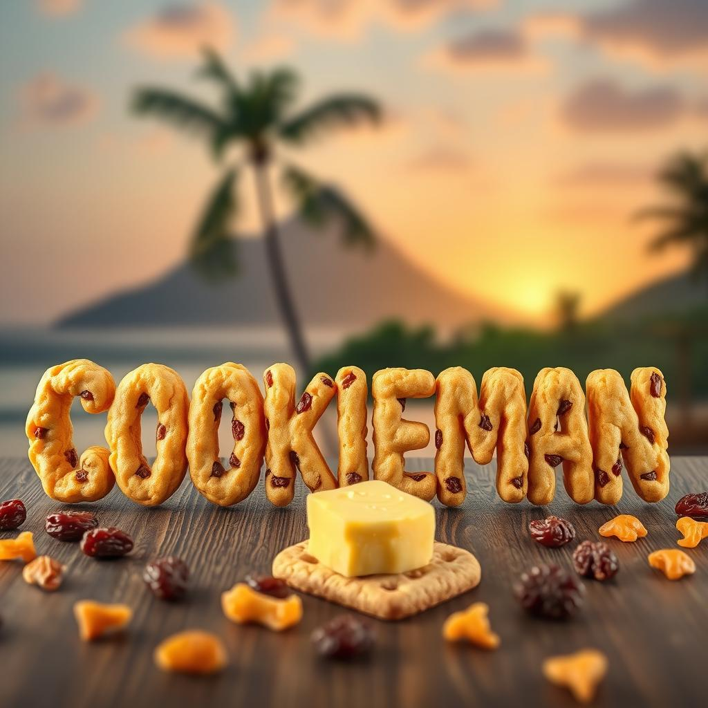
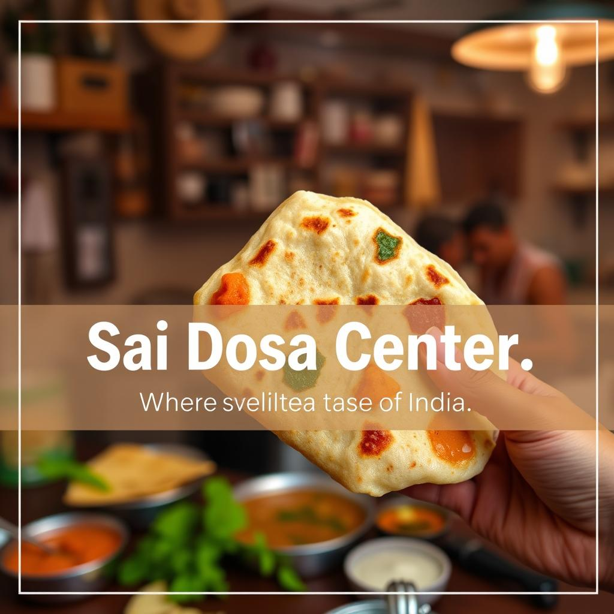
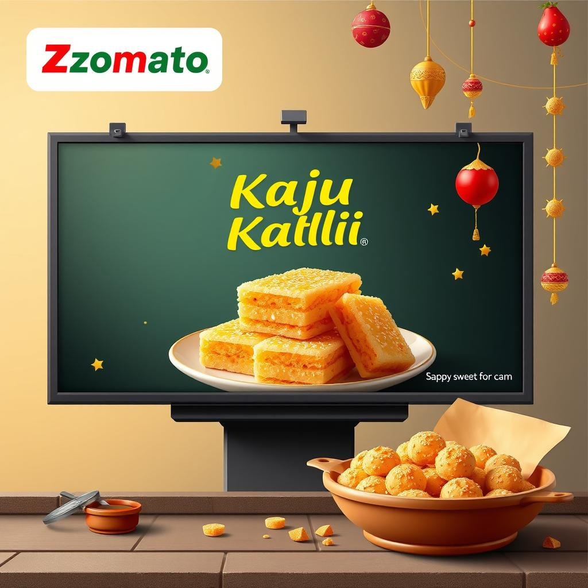
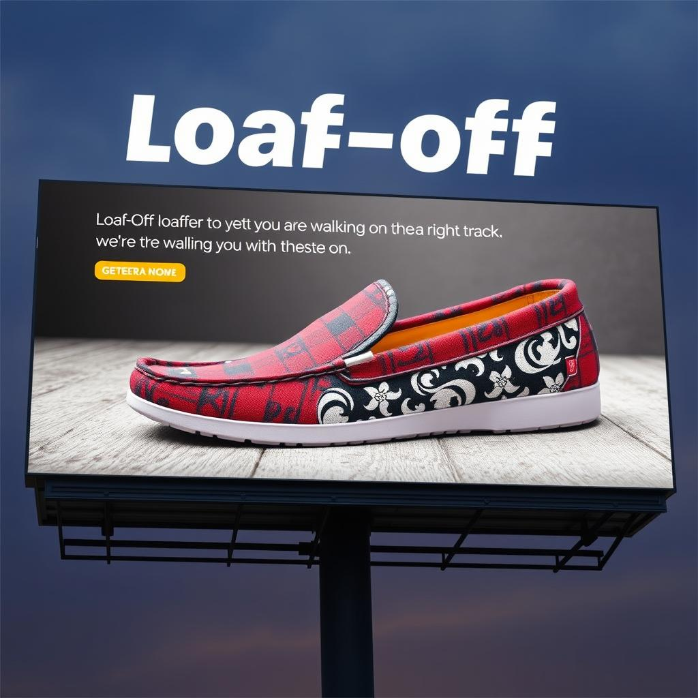

# Sellorita - AI-Powered Marketing Assistant

Sellorita is an advanced AI solution designed to elevate your marketing efforts. Whether you're looking to generate high-quality visual content, develop marketing strategies, or plan campaigns for social media, Sellorita has you covered.

## Features

### 1. **Product Ad Generator**

- Provide your product name and description, and Sellorita will generate **extraordinary images and videos** tailored to your brand.
- Supports different ad types and target audiences to match your marketing needs.

### 2. **Marketing Chatbot**

- A powerful chatbot that suggests **marketing strategies** based on your product.
- The chatbot can also help you generate additional content, such as promotional messages or ideas for campaigns.

### 3. **Campaign Generator**

- Sellorita helps you create multiple **images for social media posts** (e.g., for Instagram, Facebook, etc.).
- Automates the generation of 2-3 **custom images** per campaign, designed to maximize engagement.

## Usage

### 1. **Ad Creation**

- Input: Product name and description.
- Output: AI-generated **images and videos** tailored for advertisements.

### 2. **Marketing Strategies**

- Engage with the chatbot to get **personalized marketing suggestions** based on your product's target market and audience.

### 3. **Social Media Campaigns**

- Use the **campaign generator** to get **visual content** for your brand's social media channels, helping you create posts that resonate with your audience.

## Tech Stack

- **Streamlit (Frontend):** Used to build an interactive and user-friendly web interface for the application, enabling easy interaction with the AI-powered tools.

- **LangChain & Gemini (LLM and Agent Creation):** LangChain is used for managing language models, while Gemini assists in building intelligent agents to process user inputs, create strategies, and generate responses.

- **Hugging Face (Image Generation Model):** Hugging Face's models are utilized for generating high-quality images based on product descriptions, supporting ad creation.

- **Stability AI (Video Generation):** Stability AI powers the video generation capabilities, creating dynamic videos from product information for use in advertisements.

## Future Improvements

- **Advanced Customization:** Enable users to further customize ads and campaigns by adjusting color schemes, fonts, and templates.

- **Multi-Platform Campaign Deployment:** Allow direct posting of generated content to multiple social media accounts (e.g., Instagram, Facebook, Twitter) from within the app.

- **Multi-Language Support:** Expand the chatbot and ad generation to support multiple languages, making Sellorita more versatile for global markets.

## Installation

1. Clone the repository:
   ```bash
   git clone https://github.com/CShah44/Sellorita.git
   ```
2. Install dependencies:
   ```bash
   pip install -r requirements.txt
   ```
3. Set up environment variables:

- Create a `.env` file in the root directory of the project.
- Add the following variables to the `.env` file:
  ```makefile
  HF_TOKEN=your_hf_token
  GEMINI_API_KEY=your_gemini_api_key
  LANGSMITH_API_KEY=your_langsmith_api_key
  STABILITY_API_KEY=your_stability_api_key
  ```

4. Navigate to the project directory:
   ```bash
   cd sellorita
   ```
5. Start the application:
   ```bash
   streamlit run main.py
   ```

## Proposal

https://docs.google.com/presentation/d/1NsWRoHhxH55TOiRWQ1LyZm8cCHF8dk3WsZK8liPO6M8/edit?usp=drive_link

We Cooked and Served You a Delicious AI-Powered Marketing Assistant! 😎

## Some Works by Our Sellorita

<p align="center">
  
  
  
</p>

<p align="center">
  
  
  
</p>

<p align="center">
  
  
  
</p>

### Team: TheBoyz

- [Chaitya Shah](https://github.com/CShah44)
- [Krishna Sai](https://github.com/melohub-xbit/)
- [Hitanshu Seth](https://github.com/Hitanshu078)
